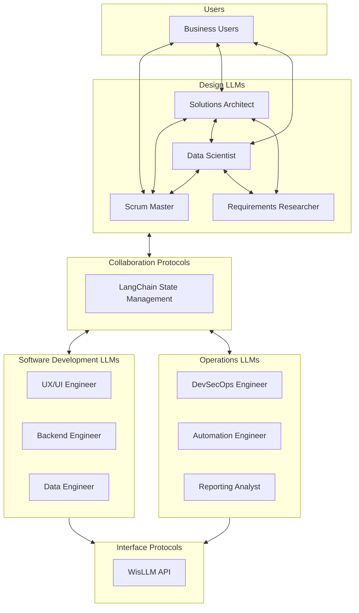

# WisLLM

LLM Agentic Development Team, designed to support business-as-code platforms, services, and data.

### MVP Goals

- Develop comprehensive requirements documentation for a project.
- Copilot instructons for each LLM/Agent should be generated from the requirements.
- Write the initial stories necesary to implement the project.
- Develop a plan and priorities to tackle the project in an agile manner.
- Scrum Master LLM should be able to delegate tasks to the appropriate agents.
- Each LLM developer should focus on their specific expertise and delivery only on the next iterative task

### Design Philosophy

- **Locally Capable**: Each agent and LLM should be capable of running on local computers.
- **Energy Efficiency**: The system should be designed to minimize energy consumption, allowing for efficient operation on local hardware.
- **Feedback Required**: Every agent should demand and require feedback from one another or the user.
- **Agentic**: Agents should be able to operate independently, but also collaborate when necessary.
- **Collaborative**: Agents should be able to work together to achieve a common goal.
- **Agile Development**: The system should be designed to support agile development practices, allowing for rapid iteration and improvement.
- **Complexity**: LLM Context use-cases and windows should be minimized to reduce complexity and improve performance.
- **Modular**: The system should be modular, allowing for easy integration or swapping of new agents and services.

### WisLLM Design Architecture



### Folder Structure

```plaintext
WisLLM/
├── pyproject.toml                     # Root workspace configuration
├── scripts/
│   ├── build.sh                       # Build script for the project
│   ├── deploy.sh                      # Deployment script
│   └── run-local.sh                   # Run script for the project
├── src/      
│   ├── __init__.py                    # Package initialization
│   ├── main.py
│   ├── agents/                        # Main entry point for the applicatio
│   |   ├── scrum_master/              # Scrum Master Agent
│   |   │   ├── langgraph.json
│   |   |   ├── graph.py
│   |   |   ├── nodes.py
│   |   |   └── prompts.py
│   |   ├── researcher/                # Requirements Researcher Agent
│   |   ├── data_engineer/             # Data Engineer Agent
│   |   ├── data_scientist/            # Data Scientist Agent
│   |   ├── uiux_engineer/             # UX/UI Engineer Agent
│   |   ├── devsecops_engineer/        # DevSecOps Engineer Agent
│   |   ├── automation_engineer/       # Automation Engineer Agent
│   |   ├── architect/                 # Solutions Architect Agent
│   |   ├── report_analyst/
│   |   └── notification_agent/
│   └── shared/                        # Shared libraries for all agents
│       ├── state/                     # State management
│       │   ├── schemas.py             # Pydantic schemas
│       │   ├── store.py               # State store interface
│       │   └── sync.py                # Synchronization
│       ├── tools/                     # Common tools used by the agent
│       │   ├── cli/                   # Command-line interface tools
│       │   ├── chat/                  # Chat interface
│       │   └── networking/            # Network interface (services/integration?)
│       ├── agents/                    # Base agent classes
│       │   └── base_agent.py
│       └── comms/                     # Inter-agent communication
│           └── handoffs.py
│
└── infrastructure/
    ├── docker/
    └── kubernetes/
```

### TODO

- [ ] Update Data Team Roles (Data Scientist, Data Architect, Data Warehousing)
- [X] Fix Folder Structure
- [ ] Add LangGraph Studio integration
- [ ] Create LangGraph for Scrum Agent
- [ ] Debug Dockerfile and Docker Compose

## Getting Started

```python
uv sync
uv run main.py
```

%pip install --upgrade --quiet  vllm -q


nanonets/Nanonets-OCR-s

### Notes

API: http://localhost:2024

Docs: http://localhost:2024/docs

LangGraph Studio Web UI: https://smith.langchain.com/studio/?baseUrl=http://127.0.0.1:2024

https://github.com/langchain-ai/langgraph-studio

https://langchain-ai.github.io/langgraph/cloud/how-tos/studio/quick_start/

https://github.com/langchain-ai/langgraph

https://langchain-ai.github.io/langgraph/cloud/deployment/setup_pyproject/#specify-dependencies

https://langchain-ai.github.io/langgraph/reference/supervisor/

https://langchain-ai.github.io/langgraph/reference/agents/

https://langchain-ai.github.io/langgraph/reference/graphs/

https://langchain-ai.github.io/langgraph/cloud/reference/cli/

https://langchain-ai.github.io/langgraph/cloud/deployment/setup_pyproject/#specify-environment-variables

https://docs.smith.langchain.com/

https://langchain-ai.github.io/langgraph/tutorials/rag/langgraph_agentic_rag/
